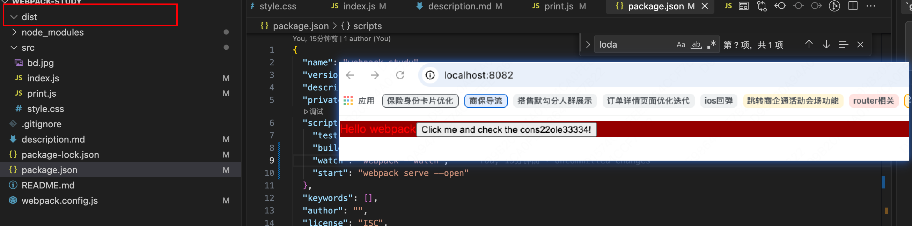

# Webpack 杂记

## 1. 对于es6支持情况
webpack默认支持import 和 export, 不需要任何配置即可使用。但是其他ES6的语法需要在loader中配置babel一样的转译器才能使用。

## 2. webpack之前用什么工具处理资源？
使用 **grunt 和 gulp** 等工具处理资源，并将它们从 /src 文件夹移动到 /dist 或 /build 目录中。JavaScript 模块也遵循同样的方式。但是，像 webpack 这样的工具将 **动态打包** 所有依赖并创建所谓的 **依赖图**。这是极好的创举，因为现在每个模块都可以 **明确表述它自身的依赖**，以避免打包未使用的模块。

## 3. webpack,cssloader或者style-loader已经内置了对于图像的处理
比如我们配置了cssloader,直接使用背景图，是没问题的


但是类似于下面的写法，会提示需要有相应的loader来处理
因此当我们配置好处理图像的loader后，效果如下（Hello webpack 文本旁边出现了 img 元素）

```js
import _ from 'lodash';
import './style.css';
import Icon from './bd.jpg';
function component() {
  const element = document.createElement('div');

  // lodash 现在使用 import 引入
  element.innerHTML = _.join(['Hello', 'webpack'], ' ');
  // 加入样式
  element.classList.add('hello')
  // 加入图片
  const myImage = new Image();
  myImage.src = Icon;
  element.appendChild(myImage);
  
  return element;
}

document.body.appendChild(component());
```


## 4. 清理 /dist 目录
webpack 生成文件并将其默认放置在 /dist 文件夹中，但是它不会追踪哪些文件是实际在项目中需要的。如果之前有遗留的代码没有清理，那么这个文件就会变得越来越乱。

通常比较推荐的做法是在每次构建前清理 /dist 文件夹，那么构建后就只会存在将要用到的文件。可以在output中使用 
**clean:true**配置选项实现这个需求。

**使用配置前：**
可以看到有一些没有使用到的，比如bundle.js和txt文件

**使用配置后：**
干净了许多，会看到构建后生成的文件，而没有旧文件！


## 5. Runtime 和 Manifest

在 Webpack 打包产物中，除了业务代码，还包含了一部分支撑代码，这就是 Runtime 和 Manifest。

### Runtime (运行时)
**定义**：Runtime 是指在浏览器运行过程中，Webpack 用来连接模块化应用程序所需的所有代码。
**作用**：
- 包含模块交互的逻辑（如 `__webpack_require__`）。
- 负责模块的加载、执行以及异步分包（Code Splitting）的加载逻辑。

“连接模块化应用程序所需的所有代码”这句话，可以把 Runtime 理解为 Webpack 注入到浏览器里的**“模块发动机”或“胶水代码”**。
如果没有这段代码，浏览器根本不认识什么是 require 或 import（尤其是在打包后的混淆代码中），也无法管理模块之间的依赖关系。
你可以从以下三个维度来深度理解：
1. 它是模块的“翻译官” (`__webpack_require__`)
在源码中你写的是 import a from './a.js'，但打包后，Webpack 会把所有的模块放进一个巨大的对象或数组里。 Runtime 会提供一个核心函数（通常叫 `__webpack_require__`），它负责：
查找模块：根据模块 ID 找到对应的代码。
执行代码：运行模块里的逻辑。
导出结果：把模块的 export 内容返回给调用者。
形象理解：就像翻译官，把各种方言（ESM, CommonJS）统一翻译成浏览器能听懂的执行指令。
2. 它是模块的“档案管理员”（缓存管理）
为了保证性能，一个模块在页面生命周期内只应该执行一次。 Runtime 维护着一张**“已加载模块清单”**：
当你第一次请求某个模块时，Runtime 执行它并把结果存入缓存。
当你第二次请求时，Runtime 直接从缓存里拿结果，不再重新执行。
形象理解：就像档案管理员，确保每份文件只被处理一次，下次要用直接翻档，避免重复劳动。
3. 它是异步加载的“调度员”（Code Splitting）
当你使用 import() 动态加载代码时，浏览器并不知道去哪里下载这个文件。 Runtime 此时充当调度员：
它知道异步模块在哪个 URL。
它负责创建一个 **script** 标签去下载这个 chunk。
下载完成后，它负责把新模块“缝合”到现有的模块系统中，并触发 Promise 的 resolve。
形象理解：就像外卖调度员，你下单（调用 import()），它负责查地图、派送并送到你手上。
总结
**“连接”**这两个字的核心含义是：让孤立的、打包后的代码块，在浏览器环境里重新建立起逻辑上的依赖关系，并能像在开发环境一样互相调用。
如果没有 Runtime，你的打包产物只是一堆死代码；有了 Runtime，它们才变成了一个能跑起来的应用程序。


### Manifest (资源清单)
**定义**：当 Webpack 构建完成后，它会生成一份所有模块的映射表，记录了源码模块与输出 bundle 之间的对应关系。
**作用**：
- 浏览器通过 Manifest 知道应该去哪个文件加载所需的模块。
- 它是 Runtime 寻找模块的“地图”。


理解 Manifest 的“模块映射表”，最简单的方式是把它想象成一份**快递单号查询表或者图书馆索引卡**。
在 Webpack 构建过程中，它解决了**名字对不上**的问题。
1. 为什么需要映射表？（核心痛点）
在开发时，你的文件名字是固定的，比如 index.js、utils.js。 但在生产环境下，为了利用浏览器缓存，Webpack 会给文件名加上哈希值（Hash），变成：
```js
index.js ➔ main.8a7b6c.js
utils.js ➔ utils.d2e3f4.js
```
问题来了：当 main.js 想要调用 utils.js 的逻辑时，它在代码里不能写死 load('utils.js')，因为实际的文件名已经变成了 utils.d2e3f4.js。而且下次你改了代码，哈希值还会变。
Manifest 就是用来记录这些“曾用名”和“现用名”对应关系的表格。

2. 映射表长什么样？
如果你把 Manifest 导出为一个 JSON 文件，它看起来大概是这样的：
```json
{
  "main.js": "main.8a7b6c.js",
  "utils.js": "utils.d2e3f4.js",
  "vendors.js": "vendors.f1g2h3.js",
  "index.html": "index.html"
}
```
对于**异步加载（Code Splitting）**的模块，它更加重要：

```json
{
  "chunk-0": "src_components_Chart_js.778899.js",
  "chunk-1": "src_pages_Home_js.aabbcc.js"
}
```
3. 它是如何工作的？
构建阶段：Webpack 像一个精明的管家，每生成一个带哈希的文件，就在小本本（Manifest）上记一笔：“原本的 A 模块，现在被我打包到了 A.hash.js 里”。
运行阶段：
当你的代码执行到 import('./Chart.js') 时。
Runtime（发动机）并不知道去哪下载。
它会去查 Manifest（映射表）：“请问 Chart.js 现在叫什么名字？”
Manifest 回答：“它现在叫 src_components_Chart_js.778899.js”。
Runtime 于是创建一个 **script** 标签，去下载这个正确的文件。
4. 形象类比：图书馆索引
源码模块：书名（如《西游记》）。
打包产物：书在书架上的物理位置（如“三楼 A 区 5 排 12 号”）。
Manifest：图书馆的电脑查询系统。
你（Runtime）想看《西游记》，你不需要知道它具体在哪，你只需要去查一下电脑（Manifest），它会告诉你现在的物理位置。即使管理员把书挪到了“二楼 B 区”，只要更新了查询系统，你依然能找到它。
总结
Manifest 是连接“逻辑文件名”和“物理文件名”的桥梁。 它让 Webpack 能够灵活地使用哈希值来优化缓存，而不需要开发者手动去修改代码里的引用路径。


### 为什么要关注它们？（长效缓存优化）
在默认情况下，Runtime 和 Manifest 是内嵌在 `main.js`（入口文件）中的。
- **问题**：即使你只改了一个很小的业务模块，Webpack 重新构建后，Manifest 中的映射关系就会改变。这会导致 `main.js` 的哈希值发生变化，从而使浏览器的缓存失效。
- **解决方案**：通过 `optimization.runtimeChunk` 将其提取为独立文件。
  ```javascript
  module.exports = {
    optimization: {
      runtimeChunk: 'single' // 将 runtime 提取为一个单独的 chunk
    }
  };
  ```
这样，当你修改业务代码时，只有业务 bundle 的哈希会变，提取出来的 `runtime.js` 虽然也会变，但它体积极小，而其他的第三方库（vendor）缓存则能被完美保留。


## 6. 深入理解 SourceMap

### 什么是 SourceMap？
**SourceMap** 本质上是一个信息文件，里面储存着位置信息。它记录了转换后的代码（如压缩后的 JS、TS 转译后的 JS）每一行、每一列在源码中的对应位置。

### 为什么需要它？（开发痛点）
现代前端代码在发布前会经过：
1. **压缩混淆**：变量名变成 `a`, `b`, `c`，且所有代码挤在一行。
2. **转译**：TypeScript 转为 JavaScript，ES6+ 转为 ES5。
3. **合并**：多个模块打包成一个 `bundle.js`。

**如果没有 SourceMap**：当代码报错时，浏览器控制台会指向 `bundle.js` 的第 1 行第 5000 列，你根本无法对应到源码。
**有了 SourceMap**：浏览器会自动加载 `.map` 文件，将错误直接定位到源码（如 `src/utils/math.ts` 第 10 行）。

### SourceMap 的工作原理
在打包产物的末尾，通常会有一行注释：
```javascript
//# sourceMappingURL=bundle.js.map
```
浏览器解析到这行注释时，会异步下载 `bundle.js.map` 文件。这个 JSON 文件里包含了：
- `sources`: 源码文件列表。
- `names`: 源码中的变量名。
- `mappings`: 一个复杂的 Base64 VLQ 编码字符串，记录了位置映射关系。

### Webpack 中的最佳实践
通过 `devtool` 属性配置：

| 环境 | 推荐配置 | 理由 |
| :--- | :--- | :--- |
| **开发环境 (dev)** | `eval-cheap-module-source-map` | **快**：构建速度快。**准**：能定位到源码行，且包含 Loader 转换前的代码。 |
| **生产环境 (prod)** | `(none)` 或 `source-map` | **安全**：不暴露源码。如果需要监控系统（如 Sentry）定位错误，则生成 `source-map` 但不部署到公网。 |

### 避坑指南
- **安全风险**：千万不要把 `.map` 文件直接传到生产环境的公网服务器上，否则任何人都可以通过开发者工具直接看到你的**完整源码**。
- **体积问题**：SourceMap 文件通常很大，甚至比代码本身还大，但它不会影响用户的首屏加载速度，因为它是**异步加载**且只有在**打开开发者工具**时才会触发下载。

## 7. runtimeChunk: 'single'
如果想要在一个 HTML 页面上使用多个入口起点，还需设置 optimization.runtimeChunk: 'single'
在 Webpack 配置中，optimization.runtimeChunk: 'single' 的主要作用是将 Webpack 的运行时代码（Runtime）提取到一个单独的 JS 文件中。
为了理解为什么要这么做，我们需要拆解成三个问题：
1. 什么是 Webpack 运行时（Runtime）？
Webpack 打包后的代码不仅仅是你写的业务逻辑，还包含了一段“引导代码”。这段代码负责：
在浏览器中模拟 require/import 的行为。
管理模块的加载、执行和缓存。
处理异步加载（Code Splitting）的逻辑。
2. 默认情况下会发生什么？
如果不配置 runtimeChunk，Webpack 会把这段运行时代码**打包进每一个入口文件（Entry Bundle）**中。
在你的项目中，你有两个入口：index 和 print。
index.bundle.js 会包含一份运行时代码。
print.bundle.js 也会包含一份运行时代码。
这会带来两个问题：
代码冗余：同样的引导代码被下载了两次。
缓存失效（最致命的问题）：
运行时代码中包含一个“模块清单”（Manifest），记录了所有模块的哈希值。
如果你修改了 print.js，它的哈希值会变。
由于 index.bundle.js 里的运行时代码记录了 print.js 的哈希，导致即使你没改 index.js，index.bundle.js 的内容也会跟着变。
结果：用户浏览器里原本缓存好的 index.bundle.js 失效了，必须重新下载。
3. runtimeChunk: 'single' 做了什么？
配置了这个选项后，Webpack 会创建一个名为 runtime.js（或者在你的配置中可能是 runtime.bundle.js）的文件，里面包含了所有入口共享的运行时代码。
带来的好处：
更好的长期缓存（Long-term Caching）：
当你修改业务代码时，只有对应的业务包和这个极小的 runtime 包会变。
其他没改动的业务包（Entry Bundles）的哈希值将保持不变，用户可以继续使用浏览器缓存。
一致性：确保页面上多个入口共享同一个模块加载器实例，避免潜在的冲突。
总结
在多入口（Multi-entry）应用中，配置 runtimeChunk: 'single' 是性能优化的标准做法。它通过提取共享的运行时代码，最大化地利用了浏览器的缓存机制，减少了用户在应用更新时需要下载的数据量。

## 8. webpack-dev-server
在开发环境中，webpack-dev-server 是一个非常有用的工具。它可以：
- 实时重新加载（Hot Module Replacement）：当修改了代码后，浏览器会自动刷新。
- 提供了一个本地服务器：可以访问本地资源。
- 提供了 SourceMap 支持：方便调试。

可以通过如下配置设置：
```bash
npm install --save-dev webpack-dev-server
};
```
然后在webpack.config.js中配置如下：
```json
module.exports = {
  devServer: {
    static: './dist'
  },
  optimization: {
    runtimeChunk: 'single'
  }
};
```
接着配置脚本
```json
"scripts": {
  "start": "webpack serve --open"
}
```
最后执行
```
npm start
```

为什么可以直接npm start？而不用npm run start呢？
具体原因可以参考：[npm 常见问题](../npm/index.md#7-常见问题)
因为package.json中配置了"start":"webpack serve --open"。


webpack-dev-server不会输出任何文件到dist目录中,而是将bundle输出到**内存中**，然后将它们作为可访问的资源**部署**在本地服务器，可以看到端口号为8082(因为本地8080和8081被占用了)上。因此即使我们把dist目录中之前生成的bundle删除,也不会影响服务器的访问。

这个时候我们在本地的任何改动都会实时反映到服务器上，不用再手动刷新页面。

## 8. Module 和 Chunk 和 Bundle 的区别
https://www.cnblogs.com/goloving/p/9206219.html
在 Webpack 的世界里，模块（Module）、代码块（Chunk）和资源包（Bundle）是三个处于不同阶段的概念。
module，chunk 和 bundle 其实就是同一份逻辑代码在不同转换场景下的取了三个名字：我们直接写出来的是 module，webpack 处理时是 chunk，最后生成浏览器可以直接运行的 bundle

### 核心区别
- **Module (模块)**：你编写的源代码文件（如 `.js`, `.css`, `.vue`, `.png`）。对于 Webpack 来说，万物皆模块。
- **Chunk (代码块)**：Webpack 在打包过程中，（‌代表Webpack在处理模块依赖时形成的代码块）根据入口（Entry）和各种配置（如动态导入、SplitChunks）将模块组合而成的**中间产物**。
- **Bundle (资源包)**：打包完成后，最终输出到 `dist` 目录中、供浏览器加载的**最终文件**。

### 它们的关系
通常情况下，一个 Chunk 会对应生成一个 Bundle。但在某些特殊配置下（如开启了 SourceMap），一个 Chunk 可能会生成多个 Bundle（一个 `.js` 文件和一个 `.map` 文件）。

### 形象类比：做面包
1. **Module**：原材料（面粉、水、酵母、糖）。
2. **Chunk**：半成品（揉好的面团、调好的馅料）。Webpack 把相关的原材料组合在一起，形成了几个不同的“面团”。
3. **Bundle**：最终产物（烤好的面包）。面团经过烤箱（Webpack 的输出处理）后，变成了你可以直接食用的面包。

### 为什么需要区分？
理解这个区别有助于你配置 Webpack 的高级功能：
- **Entry**：产生 Initial Chunk。
- **import()**：产生 Async Chunk。
- **SplitChunks**：将公共模块提取到单独的 Chunk 中，以减少重复打包。

## 9. 解决通过entry实现代码分割导致重复模块打包到各个bundle中问题
 修改webpack.config.js文件  配置dependOn
```json
 entry: {
    index: {
      import: './src/index.js',
      dependOn: 'shared'
    },
    print: {
        import: './src/print.js',
        dependOn: 'shared'
    },
    shared: 'lodash'
  },
  ```
  dependOn: 'shared' 表示该模块依赖于 shared（名为shared的chunk） 模块
  shared: 'lodash' 表示该模块依赖于 lodash 模块
  这里需要注意的是，shared 模块必须被包含在 entry 配置中，否则无法实现代码分割。
  shared名称可以自定义，不过需要保证dependOn的值与shared名称一致。但是shared的值"lodash"不能自定义（因为webpack回去node_modules中找）

  以下几种情况可以自定义"lodash"值：
  1.通过别名
  ```js
    resolve: {
      alias: {
        'my_lodash': 'lodash'
      }
    }
  ```
  2.引用本地文件
  ```json
   shared: './src/common-utils.js'
  ```
  3.通过数组形式把多个第三方库打包到同一个bundle中
  ```json
   shared: ['lodash', 'axios','jquery']
  ```

